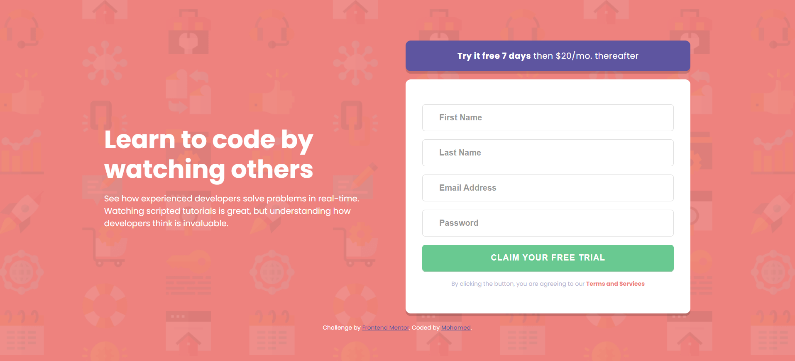

# Frontend Mentor - Intro component with sign up form solution

This is a solution to the [Intro component with sign up form challenge on Frontend Mentor](https://www.frontendmentor.io/challenges/intro-component-with-signup-form-5cf91bd49edda32581d28fd1).

## Table of contents

- [Overview](#overview)
  - [The challenge](#the-challenge)
  - [Screenshot](#screenshot)
  - [Links](#links)
- [My process](#my-process)
  - [Built with](#built-with)
  - [What I Added](#what-i-added)
- [Author](#author)

## Overview

### The challenge

Users should be able to:

- View the optimal layout for the site depending on their device's screen size
- See hover states for all interactive elements on the page
- Receive an error message when the `form` is submitted if:
  - Any `input` field is empty. The message for this error should say _"[Field Name] cannot be empty"_
  - The email address is not formatted correctly (i.e. a correct email address should have this structure: `name@host.tld`). The message for this error should say _"Looks like this is not an email"_

### Screenshot




### Links

- Solution URL: [View Solution](https://www.frontendmentor.io/solutions/intro-component-with-signup-form-1lucR04lzq)
- Live Site URL: [Watch Live](https://m-introsignup.netlify.app/)

## My process

### Built with

- Semantic HTML5 markup
- CSS custom properties
- Flexbox
- CSS Grid
- Mobile-first workflow
- Vanilla JavaScript

### What I Added

I added a simple "thank you" message if all the inputs are valid after submittion

To see how you can add code snippets, see below:

```js
let errorCount = 0;

// count how many inputs had errors and if its more than 0 do nothing
// if its 0 (all are valid) return thank you in <body>

allInputs.forEach((i) => {
  i.classList.contains(`error`) ? (errorCount += 1) : errorCount;
});

errorCount === 0
  ? (document.body.innerHTML = `
      <style>h1 {color:white; font-size:5rem;text-transform:uppercase;}</style>
      <main><h1>Thank You!</h1></main>
    `)
  : (errorCount = 0);
```

## Author

- Website - [Mohamed](https://mohamed-dev.netlify.app)
- Frontend Mentor - [@midoashraf010](https://www.frontendmentor.io/profile/midoashraf010)
